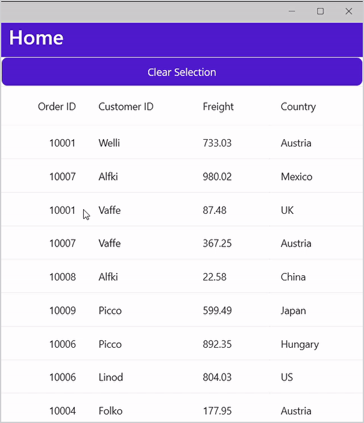

# How to clear selection in a button click using MVVM in MAUI DataGrid
In.NET [MAUI DataGrid](https://www.syncfusion.com/maui-controls/maui-datagrid) (SfDataGrid) allows you clear the selection programmatically by changing the [SelectionMode](https://help.syncfusion.com/cr/maui/Syncfusion.Maui.DataGrid.SfDataGrid.html#Syncfusion_Maui_DataGrid_SfDataGrid_SelectionMode) to [None](https://help.syncfusion.com/cr/maui/Syncfusion.Maui.DataGrid.DataGridSelectionMode.html#Syncfusion_Maui_DataGrid_DataGridSelectionMode_None). You can clear the selection in a button click in MVVM by adding **Command** and **CommandParameter** to the button.

Refer the below code example in which a Command is triggered for clearing the selection in SfDataGrid. The reference of SfDataGrid is passed as a CommandParameter to a button to clear the selection in the view model.

## XAML
```XML
<StackLayout>
    <Button Text="Clear Selection" 
Command="{Binding ClearSelection}" 
CommandParameter="{x:Reference dataGrid}" />
    <syncfusion:SfDataGrid x:Name="dataGrid"
ItemsSource="{Binding OrdersInfo}"
            AutoGenerateColumnsMode="None"
                    SelectionMode="Multiple"
                ColumnWidthMode="Auto"
            VerticalOptions="FillAndExpand">
        <syncfusion:SfDataGrid.Columns>
            <syncfusion:DataGridNumericColumn MappingName="OrderID" HeaderText="Order ID" Format="d" />
            <syncfusion:DataGridTextColumn MappingName="CustomerID" HeaderText="Customer ID"/>
            <syncfusion:DataGridTextColumn MappingName="Freight"  />
            <syncfusion:DataGridTextColumn MappingName="Country"/>
        </syncfusion:SfDataGrid.Columns>
    </syncfusion:SfDataGrid>
</StackLayout>
```

## C#
```C#
public class ViewModel : INotifyPropertyChanged
{
    private Command clearSelection;
    public Command ClearSelection
    {
        get
        {
            return clearSelection;
        }
    }       

    private void ClearSelectionCommand(object obj)
    {
        var dataGrid = obj as SfDataGrid;
        dataGrid.SelectionMode = DataGridSelectionMode.None;
    }
        
    OrderInfoRepository order;
    public ViewModel()
    {
        order = new OrderInfoRepository();
        clearSelection = new Command(ClearSelectionCommand);
        SetRowstoGenerate(50);
    }

    private ObservableCollection<OrderInfo> ordersInfo;
    public ObservableCollection<OrderInfo> OrdersInfo
    {
        get { return ordersInfo; }
        set { this.ordersInfo = value; }
    }

    public void SetRowstoGenerate(int count)
    {
        ordersInfo = order.GetOrderDetails(count);
    }

    public event PropertyChangedEventHandler PropertyChanged;
    public void RaisePropertyChanged(string propertyName)
    {
        if (PropertyChanged != null)
            this.PropertyChanged(this, new PropertyChangedEventArgs(propertyName));
    }
} 
```

## Conclusion
I hope you enjoyed learning about how to Clear Selection in a button in MAUI DataGrid (SfDataGrid).

You can refer to our [.NET MAUI DataGrid’s feature tour](https://www.syncfusion.com/maui-controls/maui-datagrid) page to know about its other groundbreaking feature representations. You can also explore our .NET MAUI DataGrid Documentation to understand how to present and manipulate data.
For current customers, you can check out our .NET MAUI components from the [License and Downloads](https://www.syncfusion.com/account/downloads) page. If you are new to Syncfusion, you can try our 30-day free trial to check out our .NET MAUI DataGrid and other .NET MAUI components.
If you have any queries or require clarifications, please let us know in comments below. You can also contact us through our [support forums](https://www.syncfusion.com/forums), [Direct-Trac](https://support.syncfusion.com/account/login?ReturnUrl=%2Faccount%2Fconnect%2Fauthorize%2Fcallback%3Fclient_id%3Dc54e52f3eb3cde0c3f20474f1bc179ed%26redirect_uri%3Dhttps%253A%252F%252Fsupport.syncfusion.com%252Fagent%252Flogincallback%26response_type%3Dcode%26scope%3Dopenid%2520profile%2520agent.api%2520integration.api%2520offline_access%2520kb.api%26state%3D8db41f98953a4d9ba40407b150ad4cf2%26code_challenge%3DvwHoT64z2h21eP_A9g7JWtr3vp3iPrvSjfh5hN5C7IE%26code_challenge_method%3DS256%26response_mode%3Dquery) or [feedback portal](https://www.syncfusion.com/feedback/maui?control=sfdatagrid). We are always happy to assist you!
